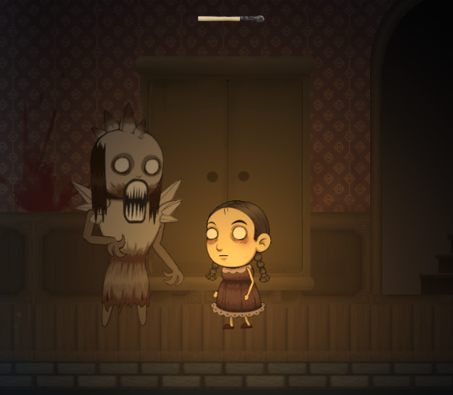

# Heidi's Quest: Mansion of Shadows

### Target Audience & Platform  

Genre: 2D Side-scrolling Horror 

Target Audience: Age 18+ 

Platform: Mobile, PC 

Once upon a time, in a quaint village nestled between misty hills, lived a courageous 10-year-old girl named Heidi. She had fiery red hair that matched her determination and a heart full of love for her family. Heidi had recently discovered that her beloved little brother, Timmy, had been captured by a terrible monster that haunted the surrounding forest.

Braving the darkness that had settled over the land, Heidi made a bold decision. She couldn't bear the thought of her brother suffering in the clutches of that dreaded creature any longer. With a deep breath and unwavering resolve, she embarked on a perilous journey to rescue Timmy from the clutches of the beast.

The monster's lair was a mansion that loomed ominously at the edge of the forest, its eerie silhouette against the moonlit sky sending shivers down the spines of even the bravest souls in the village. Rumors whispered of the mansion's dark secrets, and everyone knew to stay far away from it. But Heidi was not deterred by fear; her love for her brother was her guiding light.

As she ventured into the mansion, a chilling silence enveloped her. The only source of light in the deep heart of the castle was the faint glow of little matches that Heidi and Timmy had managed to leave behind while being dragged to the attic. Each matchstick represented a moment of hope, a silent cry for help.

## Overview

In "Mansion of Shadows," players embark on a harrowing journey through a sinister mansion to rescue their kidnapped sibling. Their mission is to explore eerie rooms while evading a relentless monster. Players can hide behind objects and collect matches to light their way, but running out of matches means certain peril.

Strategic use of doors and stairs is essential for progression, all while controlling when to light matches adds suspense. Death is always a looming threat, whether it's the monster catching the player or matches burning out.

Future updates promise to enhance gameplay with crawling, sneaking, and moving while hiding. "Mansion of Shadows" offers an immersive, heart-pounding experience as players confront their deepest fears to save their sibling from the clutches of darkness.

### Objectives

**Primary Goal and Purpose of the Game:**

The primary goal of "Mansion of Shadows" is to provide players with an immersive and spine-chilling horror experience. Players must navigate through a dark and foreboding mansion to rescue their kidnapped sibling, all while evading a relentless monster. The game's purpose is to engage players in a suspenseful and thrilling adventure, testing their wit and courage as they explore eerie rooms, collect matches to light their way, and strategically hide to avoid the monster's deadly grasp. The ultimate objective is to survive this nightmarish ordeal and reunite with the kidnapped sibling.

**Reason for Creating the Game:**

The decision to create "Mansion of Shadows" was driven by a desire to offer players an intense and immersive horror gaming experience. The horror genre has always been captivating, with its ability to evoke strong emotions and create memorable gameplay moments. With "Mansion of Shadows," we aimed to tap into the fear of the unknown, the tension of hiding from a relentless threat, and the satisfaction of overcoming terrifying obstacles.

The inclusion of mechanics like collecting matches and using them to light the way adds an element of suspense and resource management, making the game more engaging. Additionally, the promise of future updates with advanced mechanics such as crawling, sneaking, and moving while hiding ensures that the game will evolve and continue to challenge players.

In essence, "Mansion of Shadows" was created to provide an adrenaline-pumping and fear-inducing experience that appeals to horror game enthusiasts, offering them a chance to confront their fears and emerge victorious in the face of darkness.

## Features

- **Feature 1: Stealth and Hiding Mechanic**

  - In "Mansion of Shadows," players have the ability to hide behind various objects strategically placed throughout the mansion. This feature allows them to evade the relentless monster patrolling the mansion. It adds a layer of tension and strategy to the gameplay, as players must choose when and where to hide to avoid being caught.

- **Feature 2: Match Collection and Lighting**

  - A central gameplay element in the game is the collection of matches. Matches are scattered throughout the mansion, and players must collect them to light their way in the darkness. This feature not only serves as a source of light but also introduces a resource management aspect to the game. Players must decide when to use matches to explore and when to conserve them to avoid running out and facing certain peril.

- **Feature 3: Dynamic Environment with Doors and Stairs**
  - "Mansion of Shadows" features a dynamic environment with doors and stairs that players can interact with strategically. Doors allow access to different rooms and areas within the mansion, while stairs enable players to explore multiple floors. This feature encourages exploration and puzzle-solving, as players must choose the right paths to progress deeper into the mansion and uncover the whereabouts of their kidnapped sibling.

## Challenges

#### During the development of "Mansion of Shadows", we encountered several challenges, each providing valuable learning experiences:

### Challenge 1: Team Initiation and Collaboration

- **Description:** At the project's outset, forming a cohesive team was a significant challenge. We were a group of individuals with diverse backgrounds and skill levels. Aligning our goals, defining roles, and establishing effective communication channels required effort.
- **How it was overcome:** We held team meetings to foster a sense of unity and collaboration. Regular communication helped us understand each team member's strengths and weaknesses, enabling us to allocate tasks effectively.

### Challenge 2: Learning and Applying Coding Skills

- **Description:** Some team members were novice coders, and grasping coding concepts for game development presented a steep learning curve.
- **How it was overcome:** We dedicated time to self-learning, sought help from experienced members, and used online resources and tutorials to enhance our coding skills. Collaboration on coding tasks allowed us to learn from one another's experiences.

### Challenge 3: Designing Logical Game Mechanics

- **Description:** Designing and implementing engaging and logically sound game mechanics, such as stealth and resource management, posed a challenge.
- **How it was overcome:** We conducted brainstorming sessions to refine our game mechanics and tested them iteratively. Playtesting helped us fine-tune the mechanics to ensure an enjoyable player experience.

### Challenge 4: Project Management and GitHub Usage

- **Description:** Effective project management and utilizing GitHub for version control were crucial yet challenging aspects of the project.
- **How it was overcome:** We organized the project into manageable tasks, established timelines, and utilized GitHub for version control, branching, and merging. Regular team meetings ensured everyone was on the same page regarding project progress and goals.

#### Overcoming these challenges not only strengthened our skills but also fostered teamwork and determination among our development team. These experiences contributed to the successful development of "Mansion of Shadows" and enriched our collective knowledge as game developers.

## Lessons Learned

#### From the process of creating "Mansion of Shadows", we learned valuable lessons that have significantly contributed to our growth as game developers and team members:

### Lesson 1: The Power of Effective Teamwork

- **What We Learned:** We realized that effective teamwork is the foundation of a successful project. Forming a cohesive team, defining roles, and maintaining open communication were pivotal to overcoming challenges and achieving our goals.

### Lesson 2: The Value of Continuous Learning

- **What We Learned:** The journey from novice to proficient coders was challenging but rewarding. We discovered the importance of continuous learning and self-improvement in the rapidly evolving field of game development.

### Lesson 3: Game Mechanics Are at the Heart of Gameplay

- **What We Learned:** Game mechanics play a crucial role in creating an engaging player experience. Designing, testing, and refining our game mechanics taught us the significance of player interaction and satisfaction.

### Lesson 4: Effective Project Management Is Essential

- **What We Learned:** Efficient project management is vital for keeping a development project on track. Organizing tasks, setting timelines, and utilizing version control tools like GitHub were essential to our project's success.

### Lesson 5: Adaptability and Iteration Are Key

- **What We Learned:** We learned to be adaptable and embrace iteration. Receiving feedback from playtesting and making necessary adjustments was fundamental to creating a polished and enjoyable game.

#### These lessons have not only enriched our knowledge but have also shaped our approach to future game development endeavors. We carry these experiences with us as valuable assets, ensuring that our future projects continue to evolve and improve.

## Future Improvements

#### Here are some potential improvements and features we'd like to add in the future:

- **Improvement 1:** Enhanced Stealth Mechanics
        Description: We aim to further refine and expand the stealth mechanics, allowing players to have even more control over their hiding and sneaking actions. This will add depth to the gameplay and create more strategic opportunities for players to outwit the monster.

- **Improvement 2:** Additional Gameplay Elements
        Description: We plan to introduce additional gameplay elements to keep the experience fresh and exciting. These could include interactive puzzles, new types of hazards, or unique challenges in different mansion areas, adding complexity to the overall gameplay.

#### Additionally, it's worth noting that the game is still in development, and our ultimate goal is to bring the project to completion. We look forward to enhancing the player experience and delivering a fully realized gaming experience.        

## Technologies Used

In the development of Game 1, we utilized several key technologies:

- **Unity:** Our game engine, providing the foundation for development and graphics rendering.

- **C#:** The primary programming language used for game logic and mechanics within Unity.

- **ChatGPT:** Assisted in generating and refining in-game dialogues and narratives for immersive storytelling.

- **Clip Studio Paint:** Used for creating game assets such as character sprites and backgrounds.

- **Adobe Photoshop:** Employed for image editing and enhancing visual quality.

- **GitHub:** Facilitated version control and team collaboration.

## Credits

- **Developer**: [Ilkka Eskola](https://github.com/IlkkaEskola), [Miqueas Orellana](https://github.com/milquejas)
- **Artist**: [Mirva Tulonen](https://github.com/mirvatu), [Janne Hämäläinen](https://github.com/Puritani4)
- **Sound Designer**: [Janne Hämäläinen](https://github.com/Puritani4)
- **Additional Credits** to [**Janne Hämäläinen**](https://github.com/Puritani4) for creating the [*'There Will Be Darkness'*](https://youtu.be/apj2Wr8JJCQ) trailer!!

## Links

- [**GitHub Repository**](https://github.com/milquejas/There-Will-Be-Darkness)

<!-- ## Screenshots

<!-- 

 -->

## Contact Information

- **Email**: [Email](mailto:miqueas.orellana@outlook.com)
- **LinkedIn**: [LinkedIn](https://www.linkedin.com/in/miqueasorellana/)
- **GitHub**: [GitHub](https://github.com/milquejas)
- **Instagram**: [Instagram](https://instagram.com/justdoitmikeoriginal)
